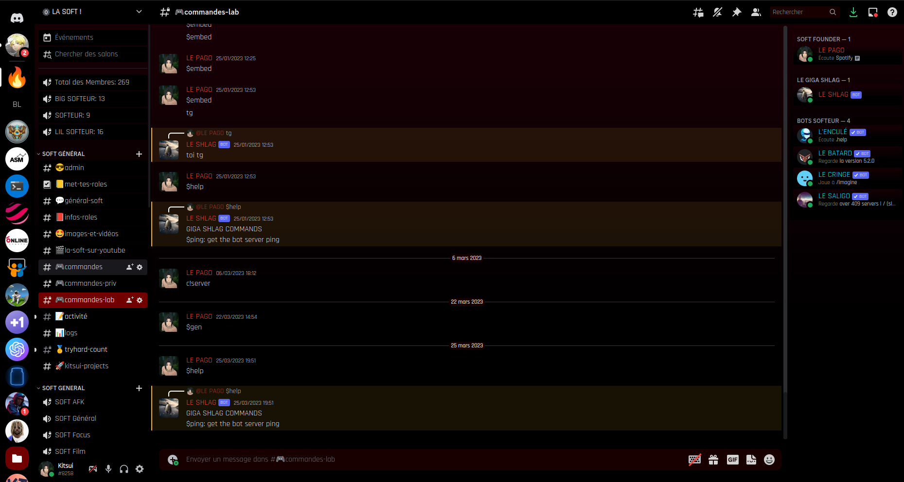
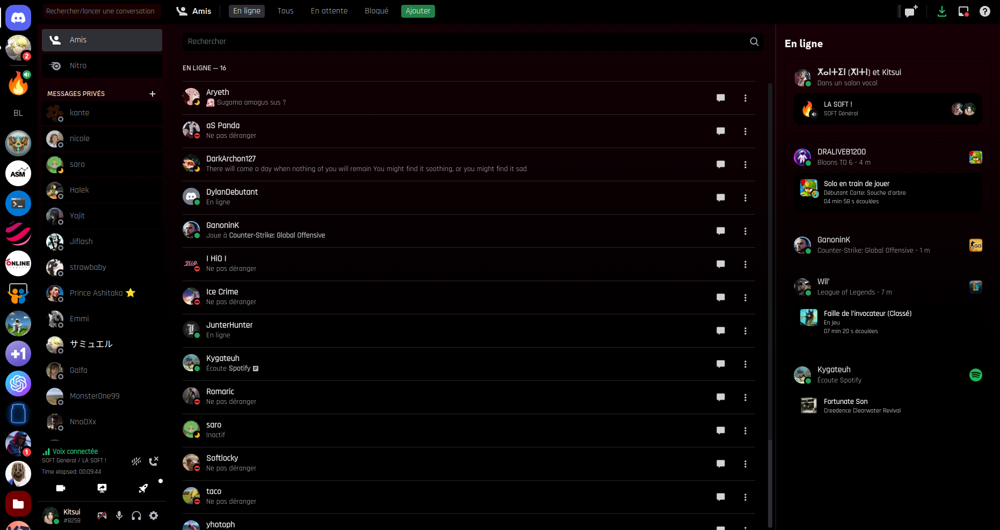

# Bloody Dark Mode Discord Theme

A Dark-Mode Discord theme for BetterDiscord users 

## How To Install BetterDiscord

### Windows

> Download and install BetterDiscord: https://betterdiscord.app/

### Linux

> Install betterdiscordctl with curl

```txt
$ curl -O https://raw.githubusercontent.com/bb010g/betterdiscordctl/master/betterdiscordctl
$ chmod +x betterdiscordctl
$ sudo mv betterdiscordctl /usr/local/bin
```

> You can then keep `betterdiscordctl` up to date with this command:
> ```
> $ sudo betterdiscordctl self-upgrade
> ```

> Install BetterDiscord

Replace `[COMMAND]` with `install` to install BD for the first time,
`reinstall` to reinstall BD after a Discord update,
or `uninstall` to uninstall an existing installation.

- For Stable

```
$ betterdiscordctl [COMMAND]
```

- For PTB

```
$ betterdiscordctl --flavor PTB [COMMAND]
```

- For Canary

```
$ betterdiscordctl --flavor Canary [COMMAND]
```

- For Snap

```
$ betterdiscordctl --d-install snap [COMMAND]
```

- For Flatpak

```
$ betterdiscordctl --d-install flatpak [COMMAND]
```

## How to add 'Bloody Dark Mode Discord Theme' to your Discord client

Once BetterDiscord is installed:

> Reload your Discord client

> Copy the whole code inside 'bloody-dark-mode-ds-theme.css'

> Go to the Discord settings, scroll until the 'Custom CSS' tab

> Paste into the editor window

## License

See LICENSE.md for more details

## Previews





## Credits

#### [BetterDiscord](https://github.com/Jiiks/BetterDiscordApp) by Jiiks

#### [Bandaged BD](https://github.com/rauenzi/BetterDiscordApp) by Zerebos (rauenzi)

#### [betterdiscordctl](https://github.com/bb010g/betterdiscordctl) by bb010g


